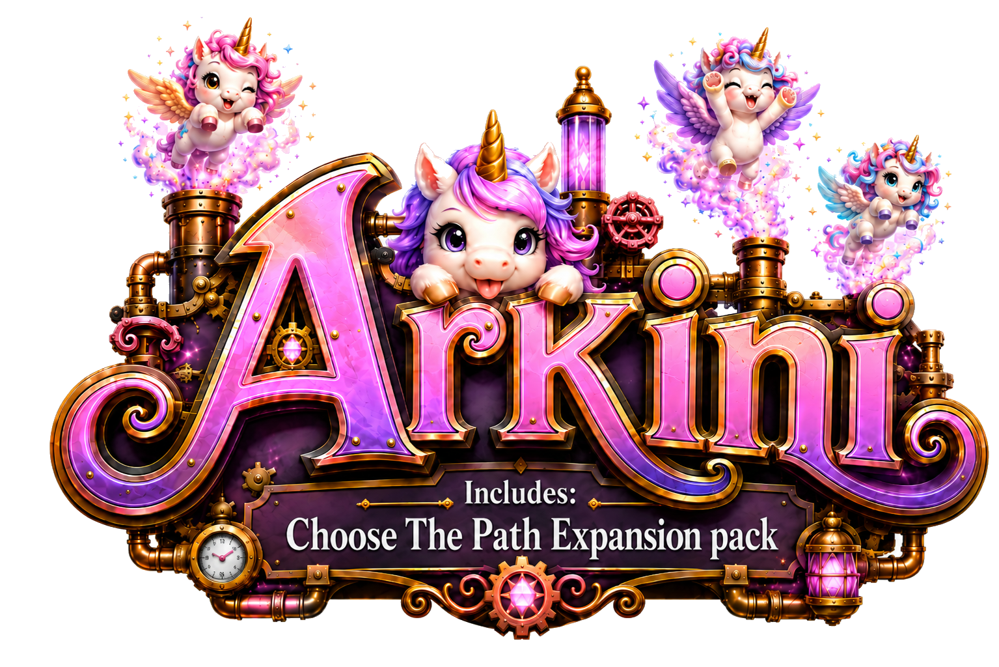

# Arkini

<p align="center">
  
</p>

Arkini is an offline Electron economy game built around merge, production, and a deterministic data-driven engine. Its Editor authors portable game projects, validates and packs them into Arkpacks, runs the real gameplay surface, and exposes authoring and analysis tools including MCP, Flow, Estimate, Versions, Notes, and Assets.

## Start here

Read the smallest entry point needed for the task:

| Task | Start at |
| --- | --- |
| Agent behavior, tests, review | [`AGENTS.md`](AGENTS.md) |
| Runtime, process, UI, Editor, persistence ownership | [`ARCHITECTURE.md`](ARCHITECTURE.md) |
| Implemented gameplay semantics | [`GAME.MD`](GAME.MD) |
| Project layout, authoring, compiler, validation | [`CONFIG.md`](CONFIG.md) |
| Compatibility, external formats, Arkpack provenance | [`VERSION.md`](VERSION.md) |
| Retained gameplay scene navigation | [`src/game-scene/README.md`](src/game-scene/README.md) |

## Repository map

```text
src/game-runtime  canonical live Runtime schemas, cheat state, validation, identity, reads and atomic publication
src/game-session  package-independent Runtime/Tick/save execution, subscriptions, fail-stop and disposal lifecycle
src/playable-game  live Game capability, resource URLs and presentation fail-stop resource wrapper
src/installed-game  Arkpack/save bootstrap, diagnostics, package leases, finalization and recovery
src/game-persistence  persisted State, hydration, save codecs, autosave and exact save transports
src/simulation-time  canonical fixed simulation quantum shared by time-aware gameplay owners
src/game-tick  fixed-step budgeting, replay, job/delivery/temporary advancement and scoped loop
src/item-interaction  optimistic drop reads, authoritative drop/write commands and ordinary click actions
src/engine    remaining common values, item/temporary/query, filesystem, revision/version and CLI support owners
src/game-start  initial-state schemas, exact placement planning and atomic runtime start
src/game-event  committed gameplay event schemas and exact downstream event projection
src/item-detail-read  shared Item Detail identity, target, tab, queue and source reads/projections
src/item-line-detail  line-detail reads, board/stored projections, inputs/outputs/autofill and Item Lines presentation
src/item-detail  Item Detail dialog composition, remaining projections and Queue/Sources/Info presentation
src/item-detail-frame  Item Detail target lifecycle, command settlement, reference navigation and frame presentation
src/game-scene  concrete Board, Toolbar and Inventory Pixi scene composition, reconciliation and delivery presentation
src/tile-presentation  semantic tile actors, feedback, replacements and committed motion projection
src/tile-rendering  Pixi application/frame/texture lifecycle, native actors, visuals and animation capabilities
src/tile-motion  retained tile-motion lanes, choreography, magnetic response and playback lifecycle
src/tile-interaction  pointer gestures, drag/drop execution, gameplay command admission and cancellation
src/item-definition  immutable authored Item schemas, query/selector vocabulary and total selection policy
src/item-location  grid coordinates, distance, runtime locations, claims and cross-space identity
src/item-placement  scope-aware stack, spawn, output and existing-item placement
src/item-merge  directional merge contracts, admission and atomic source/target lifecycle
src/space-action  authored Space items and atomic activation/navigation
src/production-action  immediate action admission, rules and charge settlement
src/production-condition  authored runtime condition evaluation
src/production-input  line-input schemas, material planning and storage lifecycle
src/production-line  production-line definitions, rules, reads and run planning
src/production-line-authoring  controlled Line, Input, Rule and Output editor UI
src/production-output  output, drop and roll schemas plus resolution policy
src/production-job  queue admission, active-job lifecycle, capacity, completion and active-job presentation
src/production-delivery  outbound input delivery allocation, validation and settlement
src/game-config  authored config, source, diagnostics, validation, resources and compiler
src/arkpack   artifact bytes/provenance, renderer catalog/runtime and package UI
src/editor-build  Build contract, renderer admission and Build presentation
src/project-authoring  portable project model, repository contract, configuration and catalog workflows
src/board-scenario  revision-pinned Board scenario contracts, session lifecycle and controls
src/project-version  immutable version graph, compatibility policies and checkout workspace
src/project-note  ordered project Notes contracts and workspace
src/authoring-mcp  renderer-side MCP status, settings and checkout presentation
src/authoring-session  mounted project publication, refresh, replacement and unsaved-change authority
src/authoring-shell  cross-product Editor shell and navigation composition
src/asset-authoring  Asset catalog, validation, import/edit/delete sessions and product presentation
src/item-authoring  authored Item value policy, repository/session Effects and product UI
src/flow      canonical authored acquisition graph and origin projection
src/flow-layout  Flow geometry, routing algorithms and worker lifecycle
src/flow-canvas  global Flow projection, painter policy and product UI
src/estimate-demand  concurrent consumed-and-reusable demand grouping policy
src/estimate-witness  immutable selected-fact witness vocabulary
src/estimate-projection  normalized Estimate DAG and optimistic critical-path projection
src/estimate  bounded-distribution Estimate orchestration, topology, expected runs, cache and worker
src/launcher  renderer bootstrap, Hero lifecycle, shell/action surfaces and About motion
src/game-presentation  mounted-Game React context, selectors, events, command settlement and failures
src/game-shell  Board, Inventory, gameplay resources and overlay composition
src/game-menu  Game Menu lifecycle, save/close commands and navigation intent
src/game-audio  committed-event cue projection and route-scoped Web Audio lifecycle
src/game-cheat  save-scoped Cheat commands, catalog, controls and item-spawn spotlight
src/application-diagnostics  shared renderer-side failure extraction, diagnostic normalization and transport policy
src/application-runtime  renderer process composition, Atom bridge and native lifecycle
src/application-settings  Appearance, Cheat availability and application Settings state, commands and presentation
src/application-shell  renderer root context, fatal surface and shared route transition/navigation behavior
src/chatgpt-asset-authoring  ChatGPT surface lifecycle and confirmed Editor Asset insertion
src/authoring-form  shared Editor form registry and canonical authored Item-reference controls
src/renderer  remaining launcher preference, PNG validation and window-mode transport capabilities
src/ui        cross-product primitives and general controls only
src/@routes   TanStack Router registration, lifecycle and route-specific composition
electron      pure transport contract plus main/preload/platform ownership
shared        immutable cross-process application metadata and hard limits only
game/arkini   official portable game project
test          focused behavioral feedback
```

The semantic dependency map and process/runtime ownership live in [`ARCHITECTURE.md`](ARCHITECTURE.md). [`.dependency-cruiser.cjs`](.dependency-cruiser.cjs) enforces only stable graph-wide directions stated directly by its named rules; it never catalogs exact current consumers. Directory grammar identifies the code layer, while the architecture contract identifies the semantic owner.

## Setup and commands

[`mise.toml`](mise.toml) pins Node, npm, and [`argc`](https://github.com/sigoden/argc). [`Argcfile.sh`](Argcfile.sh) is the only repository command surface; `package.json` is dependency metadata, not a second task runner.

```bash
mise install
argc install
argc dev
argc check
```

Use `argc --help` for the current command list. Common focused commands are:

```bash
argc typecheck
argc dc
argc test [path ...]
argc build
argc platform-check
argc game:schema
argc dev-control
argc mcp-inspect
```

`argc dc` is the read-only dependency-topology gate over every active module root and standalone TypeScript config. `argc check` runs formatting, all TypeScript configurations, a production Electron build plus Community Arkpack packing and verification, that dependency gate, copy/paste detection, and the permanent Vitest suite. `argc platform-check` is the narrower hosted macOS/Windows portability gate: it runs that production build and the real filesystem, Electron, pack, source, and schema-writer suites. Use focused tests during implementation; `platform-check` does not replace the complete closing gate.

Arkini is Electron-only: there is no web target or browser-storage fallback. Development uses the Vite renderer; packaged builds serve the same history-routed application from `arkini://app/`. Disposable build output lives below `.out/`; the official project owns its ignored `game/arkini/build/` artifacts.

## Distribution

`argc preview-macos` launches an unpacked local arm64 app. The native package commands create unsigned macOS arm64, Windows x64, Linux x64, and Linux arm64 applications. GitHub exposes the SHA-256 digest of every published release asset. Working branches run the complete repository gate on hosted Linux and the focused platform boundary gate on macOS and Windows; every platform builds and explicitly verifies a Community Arkpack. `main` deliberately runs nothing. Prerelease tags repeat the same gates before packaging, while stable tags package without rerunning them; both publish a GitHub Release. Every tag build creates the official game Arkpack once, embeds a keyless Sigstore proof for the configured distribution channel, and reuses those exact self-contained `.arkpack` bytes in every native package and standalone release artifact. Local and Editor packs are Community. Official and Community are both playable; [`VERSION.md`](VERSION.md) owns the exact soft-provenance contract.
