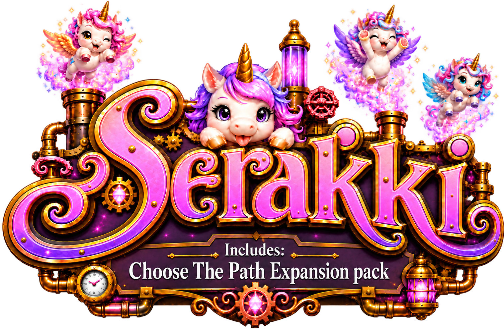

# Serakki

<p align="center">
  
</p>

Serakki is an offline Electron economy game built around merge, production, and a deterministic data-driven engine. Its Editor authors portable game projects, validates and packs them into Serapacks, runs the real gameplay surface, and exposes authoring tools including MCP, Connections, Chain, Notes, and Artwork. **Item → Connections** inspects typed direct relationships. **Item → Chain** follows authored consequences across items, spaces, and templates. Both use the revision-scoped [Graph Engine](src/graph/README.md), also exposed through MCP.

The main menu offers **New Game** for the bundled game and **Continue** when its current save exists. Starting over with existing saves requires confirmation and clears that game’s current, manual, and checkpoint saves through the existing reset lifecycle.

## Start here

Read the smallest entry point needed for the task:

| Task | Start at |
| --- | --- |
| Agent behavior, tests, review | [`AGENTS.md`](AGENTS.md) |
| Cross-cutting process, Runtime, UI, persistence and security invariants | [`ARCHITECTURE.md`](ARCHITECTURE.md) |
| Find a domain, public entrypoint or dense local map | [`DOMAIN_ATLAS.md`](DOMAIN_ATLAS.md) |
| Implemented gameplay semantics | [`GAME.MD`](GAME.MD) |
| Project layout, authoring, compiler, validation | [`CONFIG.md`](CONFIG.md) |
| Compatibility, external formats, Serapack provenance | [`VERSION.md`](VERSION.md) |

## Repository map

| Zone | Owns | Navigate from |
| --- | --- | --- |
| Gameplay state and execution | Runtime, Item/space commands, Tick, save and live Game lifecycle | [`src/game-runtime/README.md`](src/game-runtime/README.md) |
| Production | Conditions, inputs, lines, jobs, delivery and outcomes | [`src/production-line/README.md`](src/production-line/README.md) |
| Retained gameplay presentation | Tile projection/rendering/motion/interaction and concrete scenes | [`src/game-scene/README.md`](src/game-scene/README.md) |
| Authored source | Foundational values, completed Config, source files, resources, diagnostics, validation and compiler | [`src/game-config/README.md`](src/game-config/README.md) |
| Artifacts and compatibility | Serapack admission/artifact/catalog, saves and release provenance | [`VERSION.md`](VERSION.md) |
| Editor persistence | Portable repository, renderer project session, IPC, Notes and Build | [`electron/main/editor-project/README.md`](electron/main/editor-project/README.md) |
| Authored relationships | Shared DataScript graph, bounded queries, Connections and Chain | [`src/graph/README.md`](src/graph/README.md) |
| Application and platform | Launcher, renderer runtime/shell/settings, routes and Electron | [`ARCHITECTURE.md`](ARCHITECTURE.md) |

For an exact domain role and first public entrypoint, search [`DOMAIN_ATLAS.md`](DOMAIN_ATLAS.md). Directory grammar identifies the code layer; source imports and Dependency Cruiser identify the concrete graph; the owning contract identifies meaning.

## Setup and commands

[`mise.toml`](mise.toml) pins Node, npm, and [`argc`](https://github.com/sigoden/argc). [`Argcfile.sh`](Argcfile.sh) is the only repository command surface; `package.json` is dependency metadata, not a second task runner.

```bash
mise install
argc install
argc dev
argc check
```

Use `argc --help` for the current command list. Common focused commands are:

```bash
argc typecheck
argc dc
argc test [path ...]
argc build
argc platform-check
argc game:schema
argc translations:sync
argc translations:check
argc dev-control
argc mcp-inspect
```

The repository also builds a local `serakki-cli`. To discover its current commands from source, run `argc preview-cli --build -- --help` once, then use `argc preview-cli -- <subcommand> --help` to walk the command tree. For example, `argc preview-cli -- editor import --help` lists resource types, and `argc preview-cli -- editor import artwork --help` shows the project ID and `--file` arguments. The `--` passes CLI flags to `serakki-cli`; omit `--build` on later calls only when reusing the build you just made. Use `argc preview-cli -- <command> ...` to run a discovered command. This CLI can import Artwork, Music and SFX directly into a saved Editor project; see [`CONFIG.md`](CONFIG.md) for the resource rules.

`argc translations:sync` reconciles every `src/translation/*.yaml` catalog. It extracts configured literal keys, adds missing entries, removes dead static entries, preserves explicit dynamic entries, and sorts the result. `argc translations:check` performs the same work without writing and fails on drift. The renderer bundles those catalogs, negotiates against Electron's preferred languages, and falls back to `en`; there is no generated copy or runtime download.

`argc dc` checks dependency topology across every active module root and standalone TypeScript config. `argc check` runs formatting and translation drift, all TypeScript configurations, a production Electron build, Community Serapack packing and verification, dependency checks, copy/paste detection, and the permanent Vitest suite.

`argc check --skip-serapack` skips bundled game Serapack packing and verification entirely, including the cache lookup. The Electron build and all other checks still run; use plain `argc check` for the complete gate. `argc preview-macos --build --skip-serapack` also skips this step while rebuilding the app, bundling the existing Serapack if available or starting without one.

`argc check --silent` still packs and verifies the bundled game, but suppresses its warning diagnostics. Validation errors and the normal pack summary remain visible.

`argc platform-check` is the narrower hosted macOS/Windows portability gate. It runs the production build plus real filesystem, Electron, pack, source, and schema-writer suites. Use focused tests during implementation; this does not replace the complete closing gate.

Serakki is Electron-only: there is no web target or browser-storage fallback. Development uses the Vite renderer; packaged builds serve the same history-routed application from `serakki://app/`. Disposable build output lives below `.out/`; the official project owns its ignored `game/serakki/build/` artifacts.

Settings → Dev includes a two-click **Hard reset**. It permanently deletes the entire `~/.serakki` data root (including managed Editor projects, installed games, saves, preferences, and logs) and restarts the app. Projects stored outside that root are not deleted.


MCP `graph_schema` describes node IDs, typed edges, limits and examples; `graph_query` performs node lookup, direct connections, bounded traversal or `from` → `to` paths. `item_input`, `item_outcome` and `item_chain` are convenience queries over the same backend. `detail: "full"` includes operations and paths; `summary` omits those records, and a summary path query returns existence only. Every response carries its project revision and truncation status. See the [query and compatibility contract](src/graph/README.md).

MCP Board Templates have focused collection/detail reads, canonical JSON through `template_config`, creation, patching, deletion and ordered cell edits. All mutations use the project revision; descriptions point to exact input schemas. See [Template authoring](CONFIG.md#mcp-board-template-authoring) for the workflow and cell-operation contract.

MCP `schema_detail({ id, resolveDepth })` optionally inlines registered schema references. `resolveDepth` defaults to `0` (the original response) and accepts integers from `0` through `2`; each followed `$ref` consumes one level, independently per branch. Cycles, unknown references, and references at the limit remain visible as `$ref`. Embedded local fragment references retain their original resource identity. The shallow limit avoids enormous expanded authoring schemas; request remaining `$ref` IDs separately. It bounds reference depth, not a fixed response byte size.

The installed macOS CLI can list Editor projects and run one project's configured MCP server without opening the Editor:

```bash
serakki-cli project list
serakki-cli editor mcp <projectId>
serakki-cli editor mcp <projectId> --remote
```

Local MCP always starts on the port saved by the Editor. `--remote` additionally starts its saved ngrok tunnel. Running the GUI Editor and this command at the same time is unsupported and is not actively prevented.

## Distribution

The application ships as **Serakki** (`dev.marekhanzal.serakki`) with the `serakki-cli` command. Current data uses `~/.serakki`, the `serakki://` protocol, `serakki` writer provenance, and the official `game/serakki` project with package ID `serakki`. Packages use the `SERAPACK` envelope and `.serapack` extension; saves use `.serasave`. Readers accept only the current format; no previous-brand readers, aliases, or automatic data migration are provided.

`argc preview-macos --build` rebuilds and launches an unpacked local arm64 app. Always pass `--build` to platform preview commands so the opened application reflects the current source. A failed Serapack rebuild is reported but does not block this interactive preview: it keeps the last successful bundled Serapack when available, or starts without one. `argc build`, repository checks, and native package commands remain strict. Native package commands create unsigned macOS arm64, Windows x64, Linux x64, and Linux arm64 applications. GitHub exposes the SHA-256 digest of every published release asset.

The macOS application requires macOS 13 (Ventura) or newer, matching Electron 44.

Working branches run the complete repository gate on hosted Linux and the focused platform gate on macOS and Windows; every platform builds and verifies a Community Serapack. `main` deliberately runs nothing. Prerelease tags repeat those gates before packaging, while stable tags package without rerunning them; both publish a GitHub Release. The release workflow can also be dispatched from `main` with an existing `release_tag` to recover delivery without moving that tag; source checkout, version stamping, and artifact names all use the selected tag.

Every tag build creates the official Serapack once, embeds a keyless Sigstore proof for the configured distribution channel, and reuses the exact self-contained bytes in every native package and standalone release artifact. Local and Editor packs are Community. Both states are playable; [`VERSION.md`](VERSION.md) owns soft provenance.
